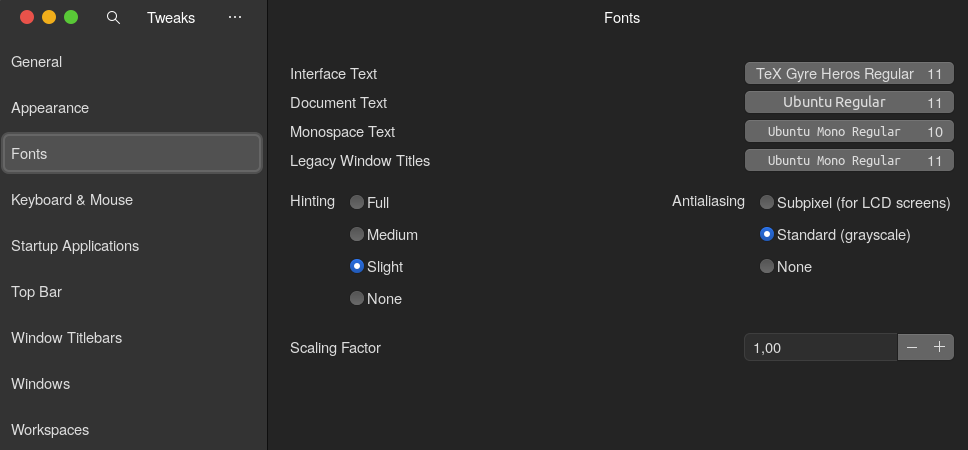

### Arch Linux (zsh + oh-my-zsh + mac look like)

------
### Welcome to my dotfiles! 

Finally I decided to upload my Arch config on some repo. This is my own personal collection of various dotfiles that i come across. It may not be all of my configs, but i will do my best to try share all of my work.

**Some of my tools:**

| Package                                                         | Type                                                             |
|-----------------------------------------------------------------|------------------------------------------------------------------|
| [Arch Linux](https://www.archlinux.org/)                        | Main distro (lts linux kernel)                                   |
| [Zsh & oh-my-zsh](https://github.com/ohmyzsh/ohmyzsh)           | Shell with configuration manager                                 |
| [Powerlevel10k](https://github.com/romkatv/powerlevel10k)       | One of the most popular ZSH themes                               |
| [neofetch](https://github.com/dylanaraps/neofetch)              | Fast and highly customizable system info script                  |
| [Nerd Fonts](https://github.com/ryanoasis/nerd-fonts)           | Fonts patched with lots of amazing icons (I use Source Code Pro) |

** Fonts and themes **

Because neofetch doesn't display my custom themes properly, there are screenshost of some of them.

